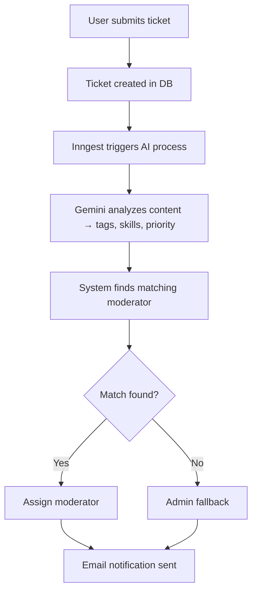

# 🤖 AI Ticket Assistant

> 🎥 Built for the **ChaiCode YouTube Series** — an AI-powered ticket management system that *automatically categorizes, prioritizes, and assigns support tickets* to the right moderators using **Google Gemini** and **Inngest**.

---

## ✨ Overview

The **AI Ticket Assistant** brings automation to customer support workflows. It classifies tickets, detects urgency, assigns moderators by skill, and even generates AI-driven notes — all with minimal setup.

---

## 🚀 Key Features

### 🧠 AI Ticket Intelligence
- Automatic categorization & priority detection  
- AI-generated moderator notes  
- Gemini-powered ticket insights  

### 👥 Smart Moderator Assignment
- Skill-based ticket routing  
- Auto-assignment with admin fallback  
- Regex-based skill matching  

### 🔐 User Management
- Role-based access control *(User, Moderator, Admin)*  
- JWT authentication  
- Moderator skill tracking  

### ⚙️ Background Processing
- Event-driven architecture via **Inngest**  
- Async email notifications  
- Scalable job handling  

---

## 🧰 Tech Stack

| Layer | Technology |
|-------|-------------|
| **Backend** | Node.js + Express |
| **Database** | MongoDB |
| **AI** | Google Gemini API |
| **Auth** | JWT |
| **Background Jobs** | Inngest |
| **Email** | Nodemailer + Mailtrap |
| **Dev Tools** | Nodemon |

---

## 📋 Prerequisites
- Node.js **v14+**
- MongoDB
- Google Gemini API key
- Mailtrap account (for testing)

---

## ⚡ Quick Start

```bash
# Clone repository
git clone <repository-url>
cd ai-ticket-assistant

# Install dependencies
npm install
```

### 🧾 Configure Environment

Create a `.env` file in the root with:

```bash
MONGO_URI=your_mongodb_uri
JWT_SECRET=your_jwt_secret

MAILTRAP_SMTP_HOST=your_mailtrap_host
MAILTRAP_SMTP_PORT=your_mailtrap_port
MAILTRAP_SMTP_USER=your_mailtrap_user
MAILTRAP_SMTP_PASS=your_mailtrap_password

GEMINI_API_KEY=your_gemini_api_key
APP_URL=http://localhost:3000
```

### ▶️ Run Locally

```bash
npm run dev         # Start main server
npm run inngest-dev # Start Inngest server
```

---

## 📡 API Endpoints

| Type | Endpoint | Description |
|------|-----------|-------------|
| **POST** | `/api/auth/signup` | Register new user |
| **POST** | `/api/auth/login` | Authenticate user |
| **POST** | `/api/tickets` | Create a ticket |
| **GET** | `/api/tickets` | View user’s tickets |
| **GET** | `/api/tickets/:id` | Get ticket details |
| **GET** | `/api/auth/users` | List all users *(Admin)* |
| **POST** | `/api/auth/update-user` | Update roles & skills *(Admin)* |

---

## 🔄 Ticket Flow



---

## 🧪 Testing

Start Inngest dev server:
```bash
npm run inngest-dev
```

Test ticket creation:
```bash
curl -X POST http://localhost:3000/api/tickets -H "Content-Type: application/json" -H "Authorization: Bearer YOUR_JWT_TOKEN" -d '{"title":"Database Issue","description":"Timeouts on queries"}'
```

---

## 🧰 Troubleshooting

| Issue | Solution |
|-------|-----------|
| **Port in use (8288)** | `lsof -i :8288` → `kill -9 <PID>` |
| **AI errors** | Check `GEMINI_API_KEY` validity & quota |
| **Email fails** | Verify Mailtrap credentials & SMTP setup |

---

## 📦 Dependencies

```
@inngest/agent-kit  bcrypt  cors  dotenv  express  inngest
jsonwebtoken  mongoose  nodemailer  nodemon
```

---

## 🤝 Contributing

This repo accompanies a ChaiCode video — contributions are **not accepted** to keep parity with the tutorial content.

---

## 🙏 Credits
- 🌀 [Inngest](https://www.inngest.com/) for background job processing  
- 🧠 [Google Gemini](https://ai.google/) for AI capabilities  
- 📬 [Mailtrap](https://mailtrap.io/) for testing  
- 🍃 [MongoDB](https://www.mongodb.com/) for persistence  
